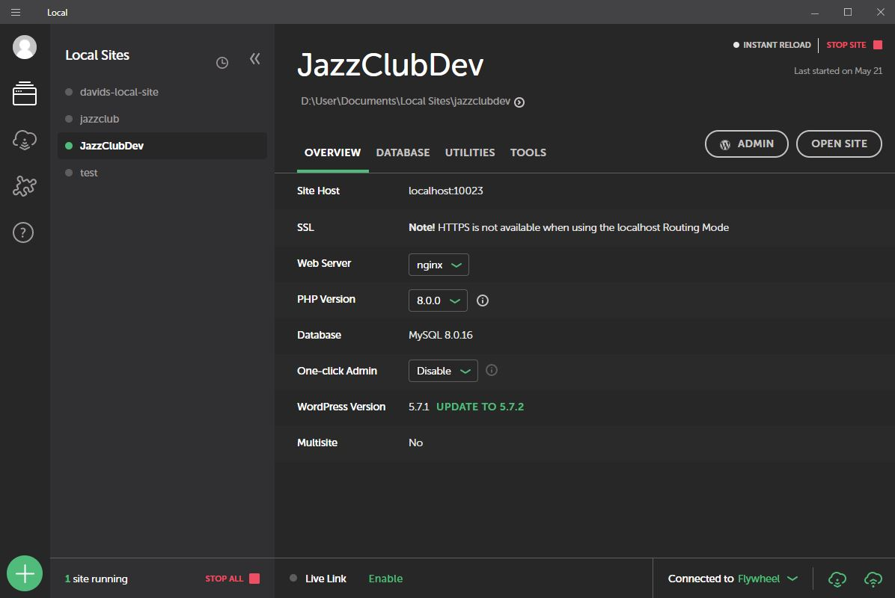

<h1>Deployment</h1>
<b>The following is how development is recommended for this project.</b>
<ol>
<li>Download and install <a href="https://localwp.com/">Local WP</a>(One-click WordPress Installation and Local development environment as LEMP stack) onto your desktop</li>
<li>Create a local environment similar to what is shown bellow</li>


<li>Clone the <a href="https://github.com/cp3402-students/cp3402-2021-site-cp3402-2021-team01/blob/develop/DEPLOYMENT.md">GitHub</a> repository into themes folder of Local environment</li>
<li>To develop features or edit/update existing features create a new branch in the repository, appropriately named by job for version control.</li>
<li>Note new developments, edits, and updates should be lodged on the Trello board, names for branches taken from theses card names.</li>    
<li>The Trello board effectively project manages and keeps a historical record of the project.</li>    
<li>Utilising a code editor such as PHPStorm or Visual Code Studio, or other IDE, and run:
```sh
$ composer install
$ npm install
```
<li>In relevant IDE customise the theme, making relevant version control commits, then push completed work to repository.</li>
<li>Create relevant pull requests to main branch.</li>
<li>Pull requests must be tested before merging to main branch.</li>
<li>Once the main branch is merged and updated with the changes, the repository can be pulled to local environment so as to be uploaded via zip file into the staging site via appearance/theme/add new, then activated to test in the staging website.</li>
<li>After testing on the staging website is successful, the theme zip folder can be uploaded to the produciton site.</li>
<li>These are the links to the hosted sites, Trello board, Slack channel and Discord server:</li>
    <ul>
        <li><a href="https://54.153.156.106/">AWS Development Site</a></li>
        <li><a href="https://jazz1.azurewebsites.net/">Azure Production Site</a></li>
        <li><a href="https://trello.com/b/iXwQkzbq/cp3402-g13-2021">Production Management Trello Board</a></li>
        <li>Slack Channel - cp3402 - project - team13</li>
        <li>Discord Server - CP3402 Group 13</li>
    </ul>
</ol>
more inc
